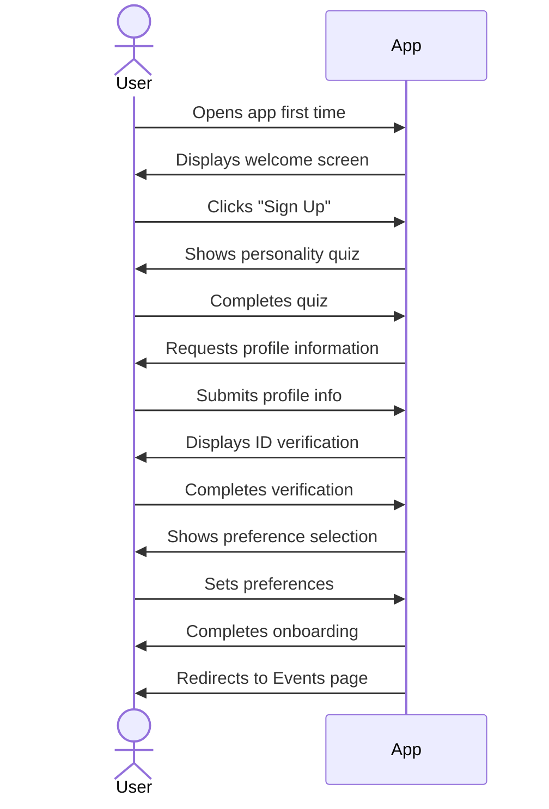
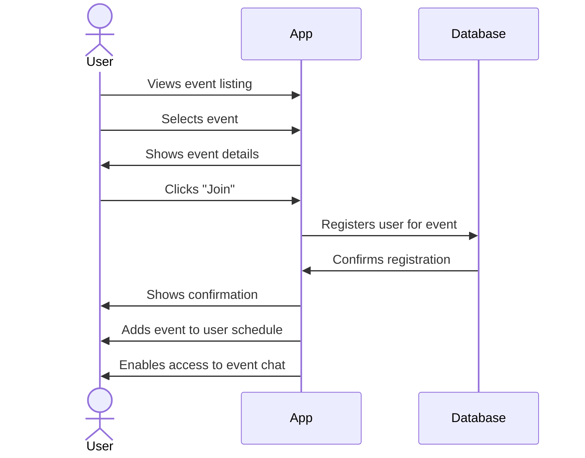
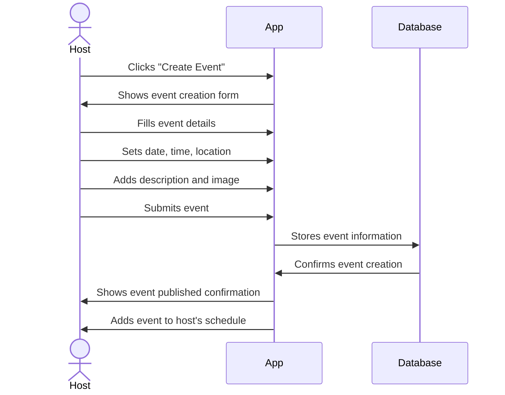
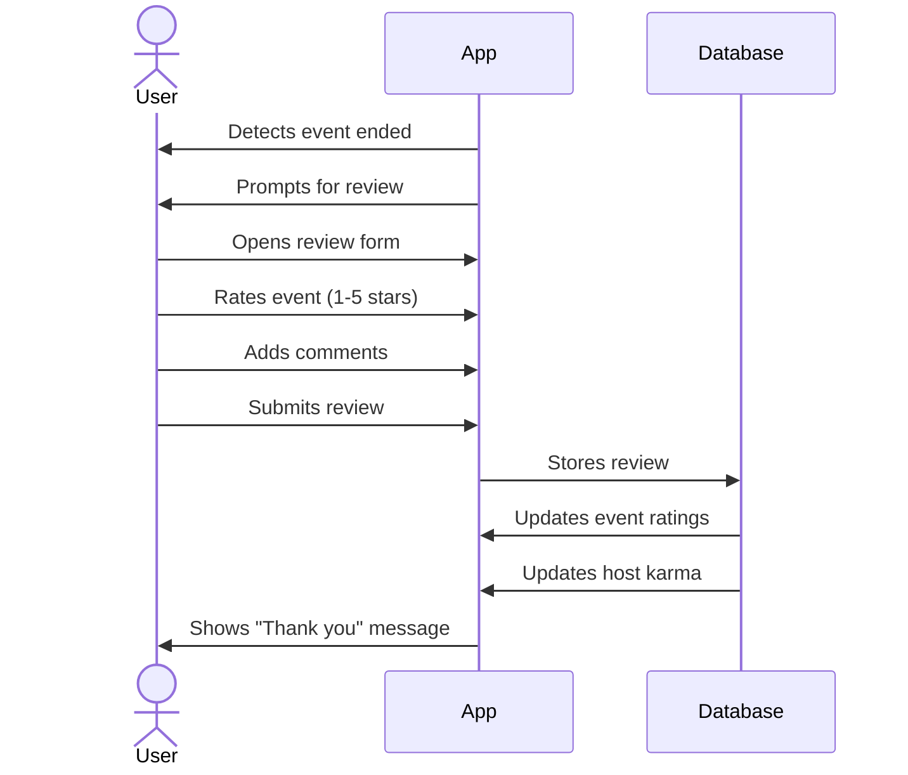

## Overview 
This proposal outlines a mobile application designed to connect people through shared events and personality-based matching. The app’s vision is to foster meaningful, in-person connections by making it easy to discover events and meet compatible individuals in a safe, engaging way. A unique personality quiz and compatibility scoring system will **bring people closer together** by gauging how well users might get along ([New App Personality Match Tests Your Compatibility With Family & Friends - Global Dating Insights](https://www.globaldatinginsights.com/news/new-app-personality-match-tests-your-compatibility-with-family-friends/#:~:text=A%20new%20app%20has%20launched,partners%2C%20friends%20and%20family%20members)). At the same time, the platform leverages the convenience of dedicated event apps – simplifying how users plan, join, and manage events, which is **far more convenient than using multiple websites or printed tickets** ([Event App Development: Top Features & Real Example - Perpetio](https://perpet.io/blog/event-app-development-top-features-real-example/#:~:text=No%20matter%20the%20type%2C%20event,are%20now%20held%20in%20hybrid)). Overall, the application aims to create a fun social ecosystem where users can find events, connect in ephemeral group chats, and build trust through profile verification and post-event reviews.

## Core Components

### 1. User Profile Component
- User avatar/photo
- Name, bio, interests
- Compatibility score (when viewed by others)
- Karma/reputation indicator
- Recent events attended/organized

### 2. Event Card Component
- Event image
- Title, date, time, location
- Brief description
- Host information
- Join/RSVP button
- Attendee count/limit

### 3. Event Details Component
- Extended event information
- Map/location data
- Full attendee list
- Chat access button
- Invite friends button

### 4. Onboarding Components
- Personality quiz module
- Profile creation form
- Preference selection
- ID verification placeholder

### 5. Navigation Components
- Bottom tab navigation (Events, Chats, Profile)
- Event category filters
- Search functionality

### 6. Chat Components
- Event group chat
- Message bubbles
- User indicators
- Ephemeral timer (if applicable)

### 7. Review/Feedback Component
- Star/numerical rating
- Comment field
- Submit button

## Sequence Diagrams

### User Registration Flow

### Event Join Flow

### Event Creation Flow

### Post-Event Review Flow

## UI/UX Flows

### 1. Onboarding Flow
1. **Welcome Screen**
   - App logo/branding
   - Brief value proposition
   - "Get Started" button

2. **Personality Quiz**
   - 5-7 brief questions
   - Simple multiple-choice format
   - Progress indicator
   - Back/Next navigation

3. **Profile Setup**
   - Photo upload
   - Name, bio fields
   - Interest selection (tags)
   - Age/basic demographic info

4. **ID Verification**
   - Placeholder for future verification
   - Simple mock verification process

5. **Preference Selection**
   - Event types of interest
   - Distance preferences
   - Notification settings

6. **Completion Screen**
   - Success message
   - Compatibility profile summary
   - "Explore Events" button

### 2. Event Discovery Flow
1. **Event Listing**
   - Featured events carousel
   - Category filters (horizontal scroll)
   - Event cards in vertical scroll
   - Search bar
   - "Create Event" floating button

2. **Event Details**
   - Hero image
   - Title, date, location
   - Host information with karma score
   - Description
   - Attendee preview (avatars)
   - Map view
   - Join/RSVP button
   - Share/Invite button

3. **Event Confirmation**
   - Success animation
   - Event added to calendar
   - "View My Events" option
   - "Invite Friends" option

### 3. Event Creation Flow
1. **Creation Form**
   - Title input
   - Date/time selector
   - Location input/map
   - Category selection
   - Description field
   - Image upload
   - Attendee limit setting
   - Public/Private toggle

2. **Preview Screen**
   - Event card preview
   - Final review of details
   - Edit option
   - Publish button

3. **Success Screen**
   - Confirmation message
   - View event option
   - Share event option

### 4. Social Interaction Flow
1. **Event Chat**
   - Group chat for event attendees
   - Message composition
   - User bubbles with compatibility indicators
   - Ephemeral chat options (if applicable)

2. **Profile Viewing**
   - View attendee profiles from event page
   - Compatibility score visualization
   - Mutual interests highlighted
   - Recent events attended
   - Karma/reputation score

3. **Post-Event**
   - Review prompt
   - Rating interface
   - Optional comments
   - Feedback on compatibility match accuracy

### 5. Navigation Structure
- **Bottom Tab Navigation**
  - Events (home)
  - My Schedule
  - Chats
  - Profile

- **Events Tab Hierarchy**
  - Main listing
  - Filters/search
  - Creation
  - Detail views

- **Profile Tab Hierarchy**
  - User profile
  - Edit options
  - Settings
  - Karma history
  - Past events

This simplified design document focuses on the core components, user flows, and interactions without diving into implementation details or complex rationales. It provides a clear blueprint for the initial development phase while allowing for iteration and expansion based on user feedback.
