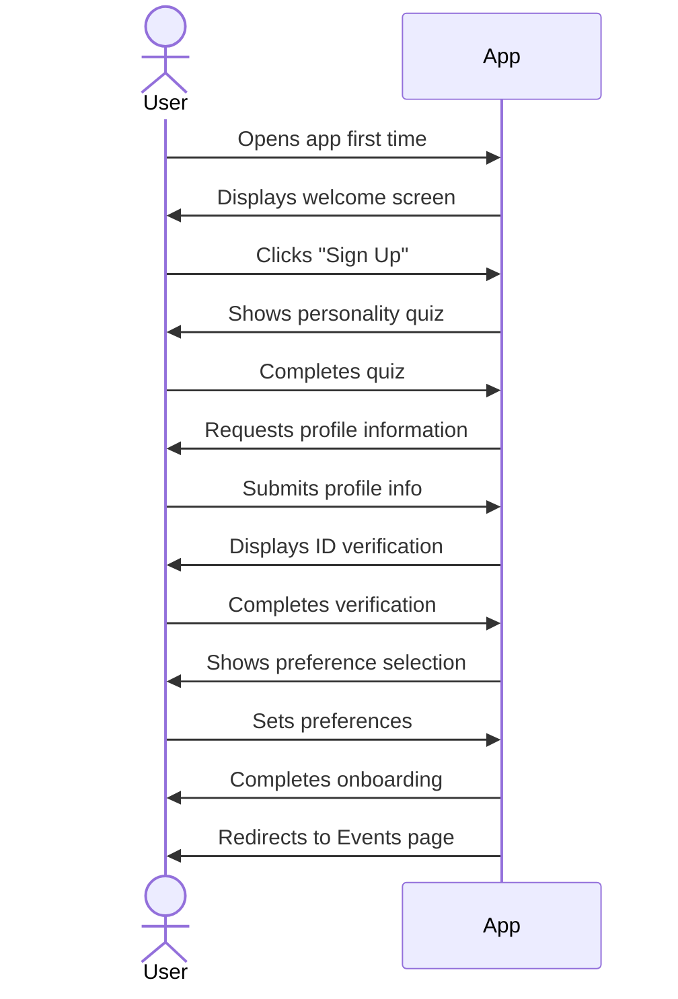
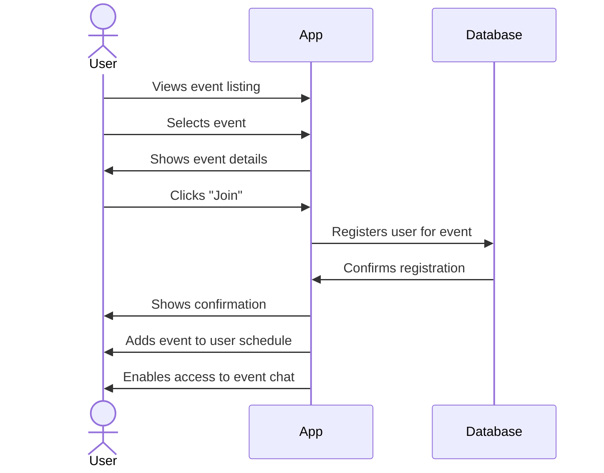
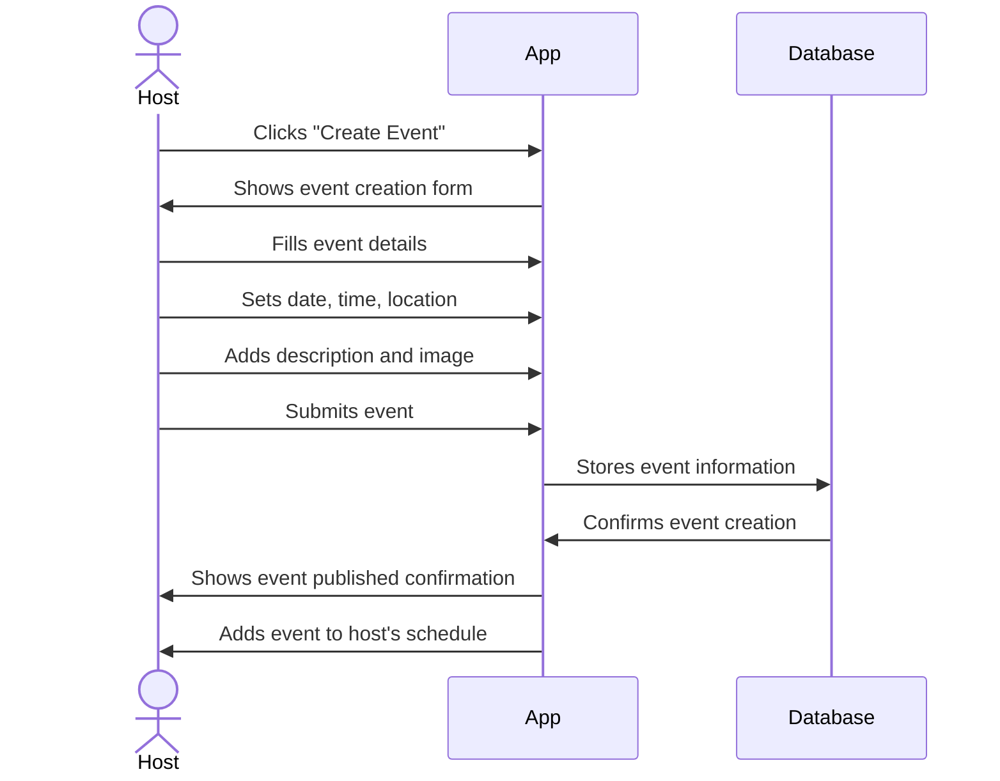
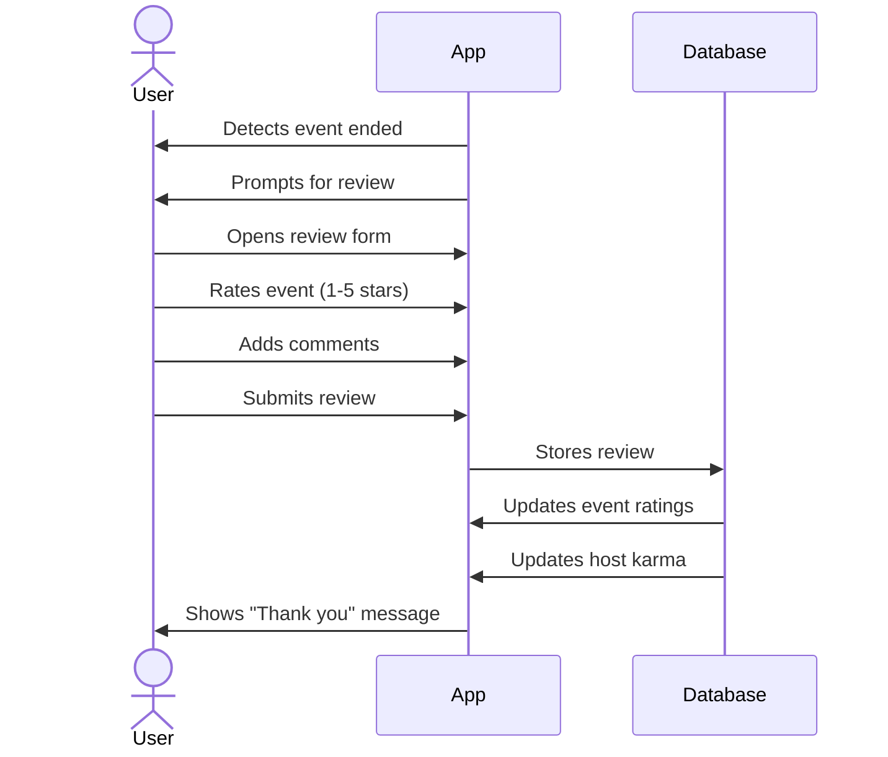

## Overview 
This proposal outlines a mobile application designed to connect people through shared events and personality-based matching. The app’s vision is to foster meaningful, in-person connections by making it easy to discover events and meet compatible individuals in a safe, engaging way. A unique personality quiz and compatibility scoring system will **bring people closer together** by gauging how well users might get along ([New App Personality Match Tests Your Compatibility With Family & Friends - Global Dating Insights](https://www.globaldatinginsights.com/news/new-app-personality-match-tests-your-compatibility-with-family-friends/#:~:text=A%20new%20app%20has%20launched,partners%2C%20friends%20and%20family%20members)). At the same time, the platform leverages the convenience of dedicated event apps – simplifying how users plan, join, and manage events, which is **far more convenient than using multiple websites or printed tickets** ([Event App Development: Top Features & Real Example - Perpetio](https://perpet.io/blog/event-app-development-top-features-real-example/#:~:text=No%20matter%20the%20type%2C%20event,are%20now%20held%20in%20hybrid)). Overall, the application aims to create a fun social ecosystem where users can find events, connect in ephemeral group chats, and build trust through profile verification and post-event reviews.


## Technology Stack 
The application will use a **React Native** front-end coupled with a **Next.js** back-end, running locally during development. React Native enables cross-platform mobile development from a single JavaScript codebase, ensuring the app runs natively on both iOS and Android devices ([High-Performance Mobile App with React Native & Next.js Backend](https://prateeksha.com/blog/developing-a-high-performance-mobile-app-with-react-native-and-next-js-backend#:~:text=Before%20we%20launch%20into%20the,on%20both%20iOS%20and%20Android)). The Next.js server will act as the local “command center” for back-end logic and APIs, handling data storage, user authentication, and other server-side needs. Next.js excels at server-side rendering and API integration, making it an exceptional choice to power the app’s back-end services ([High-Performance Mobile App with React Native & Next.js Backend](https://prateeksha.com/blog/developing-a-high-performance-mobile-app-with-react-native-and-next-js-backend#:~:text=On%20the%20flip%20side%2C%20Next,apps%20that%20perform%20exceptionally%20well)). This React Native + Next.js duo provides an optimal environment for a high-performance app, allowing us to build a fast, responsive UI backed by robust server capabilities. During the beta phase, both the mobile app and the Next.js API will run on **localhost**, which is a loopback network address used to test applications on the developer’s machine ([Running Your React Native Expo App on a Device with Local Backend - DEV Community](https://dev.to/katkelly/running-your-react-native-expo-app-on-a-device-with-local-backend-k8l#:~:text=,test%20a%20local%20development%20server)). Running everything locally facilitates quick iteration and testing without the overhead of cloud deployment. (Future stages of the project can explore deploying the Next.js back-end to a cloud server once the app is ready for broader testing.)


## Hosting & Deployment 
For the initial development and beta testing phase, the app will run in a local environment:
- **Local Deployment (Beta):** The Next.js backend will be hosted on `localhost` (the developer’s machine), typically on a port like 3000 (e.g., `http://localhost:3000`). The React Native app, when run on an emulator or device in development mode, will communicate with this local server for all API requests. Using localhost is ideal for internal testing because it allows rapid development without any network latency or internet requirements. In fact, *“localhost” points to your own computer and is useful to test a local development server* ([Running Your React Native Expo App on a Device with Local Backend - DEV Community](https://dev.to/katkelly/running-your-react-native-expo-app-on-a-device-with-local-backend-k8l#:~:text=,test%20a%20local%20development%20server)) – which is exactly our use case. We’ll ensure that developers can run the entire stack easily (perhaps with a single command that starts the Next.js dev server and the React Native packager). For testing on a physical device, we’ll use the machine’s IP address in the app config (since a phone can’t resolve `localhost` on the PC, we’ll replace it with the LAN IP).

// ... existing code ...

## Getting Started

This guide will help you set up and run both the frontend and backend components of the application for local development.

### Prerequisites

- Node.js (v14 or later)
- npm or yarn
- For React Native development:
  - Android Studio (for Android development)
  - Xcode (for iOS development, Mac only)
  - React Native CLI

### Project Setup

1. Clone the repository:
   ```bash
   git clone <repository-url>
   cd <project-directory>
   ```

2. Install dependencies:
   ```bash
   npm install
   # or
   yarn install
   ```

### Starting the Backend (Next.js)

1. Navigate to the backend directory:
   ```bash
   cd packages/web
   ```

2. Start the Next.js development server:
   ```bash
   npm run dev
   # or
   yarn dev
   ```

3. The backend server will be running at `http://localhost:3000`. You can verify it's working by visiting this URL in your browser.

### Starting the Frontend (React Native)

1. Open a new terminal window and navigate to the React Native directory:
   ```bash
   cd packages/mobile
   ```

2. Start the React Native development server:
   ```bash
   npm start
   # or
   yarn start
   ```

3. In another terminal window, run the app on your preferred platform:
   
   For iOS (Mac only):
   ```bash
   npm run ios
   # or
   yarn ios
   ```
   
   For Android:
   ```bash
   npm run android
   # or
   yarn android
   ```

### Connecting Frontend to Backend

When running in development mode, the React Native app needs to communicate with your local Next.js server:

1. For emulators:
   - Android emulator: The backend URL should be set to `http://10.0.2.2:3000`
   - iOS simulator: The backend URL should be set to `http://localhost:3000`

2. For physical devices on the same network:
   - Find your computer's IP address (e.g., 192.168.1.100)
   - Use `http://<your-ip-address>:3000` as the backend URL in the app

### Testing the Connection

1. Once both servers are running, the React Native app should be able to communicate with the Next.js backend.
2. Navigate through the app to see if data is loading correctly.
3. If you encounter connection issues, verify that:
   - Both servers are running
   - The correct IP address/port is being used
   - Your device/emulator has network access to the development machine

### Troubleshooting

- If the app can't connect to the backend, check your firewall settings
- Ensure the correct URL is configured in the React Native app
- For physical devices, make sure your phone is on the same WiFi network as your development machine

## Core Components

### 1. User Profile Component
- User avatar/photo
- Name, bio, interests
- Compatibility score (when viewed by others)
- Karma/reputation indicator
- Recent events attended/organized

### 2. Event Card Component
- Event image
- Title, date, time, location
- Brief description
- Host information
- Join/RSVP button
- Attendee count/limit

### 3. Event Details Component
- Extended event information
- Map/location data
- Full attendee list
- Chat access button
- Invite friends button

### 4. Onboarding Components
- Personality quiz module
- Profile creation form
- Preference selection
- ID verification placeholder

### 5. Navigation Components
- Bottom tab navigation (Events, Chats, Profile)
- Event category filters
- Search functionality

### 6. Chat Components
- Event group chat
- Message bubbles
- User indicators
- Ephemeral timer (if applicable)

### 7. Review/Feedback Component
- Star/numerical rating
- Comment field
- Submit button

## Sequence Diagrams

### User Registration Flow


### Event Join Flow


### Event Creation Flow


### Post-Event Review Flow

